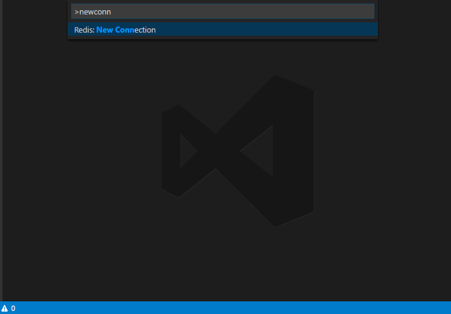

<a href="https://marketplace.visualstudio.com/items?itemName=vitorsalgado.vscode-redis"></a>
<!-- ALL-CONTRIBUTORS-BADGE:START - Do not remove or modify this section -->
[](#contributors-)
<!-- ALL-CONTRIBUTORS-BADGE:END -->

# VS Code Redis
#### Extension for Visual Studio Code 
[](https://travis-ci.org/vitorsalgado/vscode-redis) 
[](http://standardjs.com) 
 
  
Adds common Redis commands to VS Code Command Palette.

## Install
The Plugin on [Visual Studio Marketplace](https://marketplace.visualstudio.com/items?itemName=vitorsalgado.vscode-redis).
* Press `Ctrl + Shift + P`
* Pick  `Extensions: Install Extension`
* Search for **vscode-redis**

## Usage


## Features
* Multiple Redis connections;
* Switch between server connections;
* "Command Palette" supported Redis commands:
    * `info`
    * `get`
    * `set`
    * `hget`
    * `hset`
    * `del`
    * `hdel`
    * `hgetall`
    * `llen`
    * `lpush`
    * `lpushx`
    * `rpush`
    * `rpushx`
    * `lindex`
    * `linsert`
    * `lrange`
    * `lpop`
    * `rpop`
    * `lset`
    * `ltrim`

## Optional Extension Settings
You can configure multiple Redis connections on your workspace. 
First, place a file named "redis.json" in .vscode folder. Open "redis.json" and edit it following the sample below:
```
{
    "databases": [
        {
            "name": "local",
            "url": "redis://localhost:6379"
        },
        {
            "name": "production",
            "url": "rediss://production-address:9091",
            "password": "super_secret_password"
        }
    ]
}
```
Execute the command `Redis: Reload Configuration` to load the servers listed in configuration file.

## Changelog
See [Changelog](CHANGELOG.md).

## Contributing
Please read [CONTRIBUTING.md](CONTRIBUTING.md) for details on our code of conduct, and the process for submitting pull requests to us.

## Versioning
We use **[Semantic Versioning](https://semver.org/)** for versioning. For the versions available, see the tags on this repository.

## License
This project is available under MIT License. See [LICENSE](LICENSE).

## Contributors ✨

Thanks goes to these wonderful people ([emoji key](https://allcontributors.org/docs/en/emoji-key)):

<!-- ALL-CONTRIBUTORS-LIST:START - Do not remove or modify this section -->
<!-- prettier-ignore-start -->
<!-- markdownlint-disable -->
<table>
  <tr>
    <td align="center"><a href="https://github.com/chengjie"><br /><sub><b>LexCher</b></sub></a><br /><a href="https://github.com/vitorsalgado/vscode-redis/commits?author=chengjie" title="Code">💻</a></td>
    <td align="center"><a href="https://github.com/zerosandones"><br /><sub><b>Dave Glendenning</b></sub></a><br /><a href="https://github.com/vitorsalgado/vscode-redis/commits?author=zerosandones" title="Code">💻</a></td>
  </tr>
</table>

<!-- markdownlint-enable -->
<!-- prettier-ignore-end -->
<!-- ALL-CONTRIBUTORS-LIST:END -->

This project follows the [all-contributors](https://github.com/all-contributors/all-contributors) specification. Contributions of any kind welcome!
